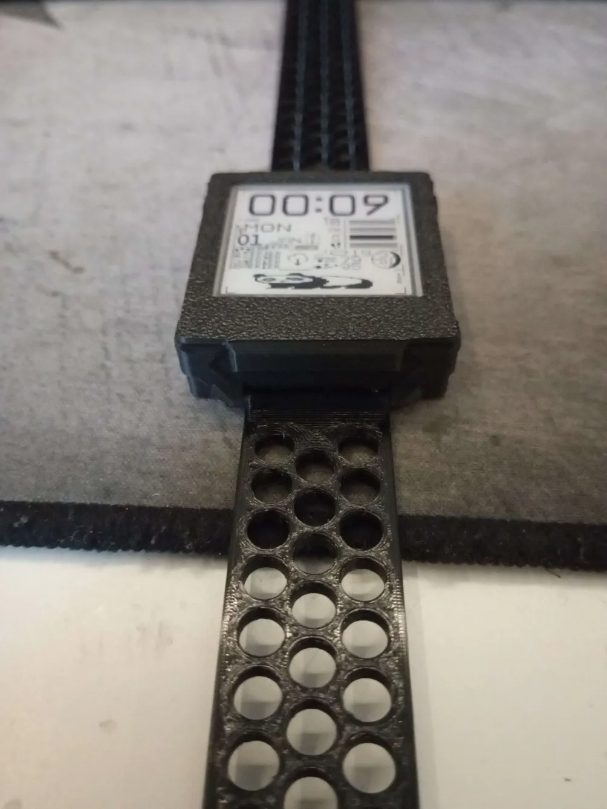
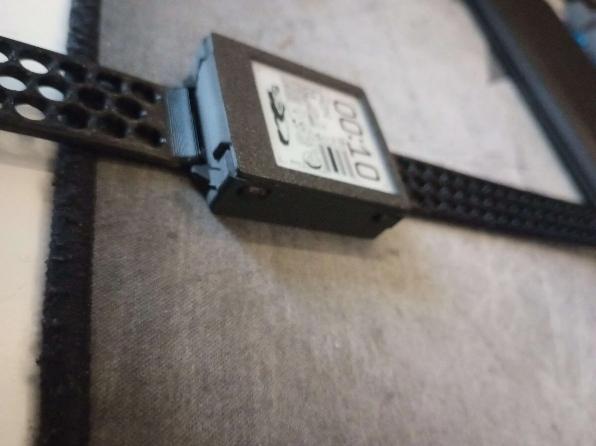
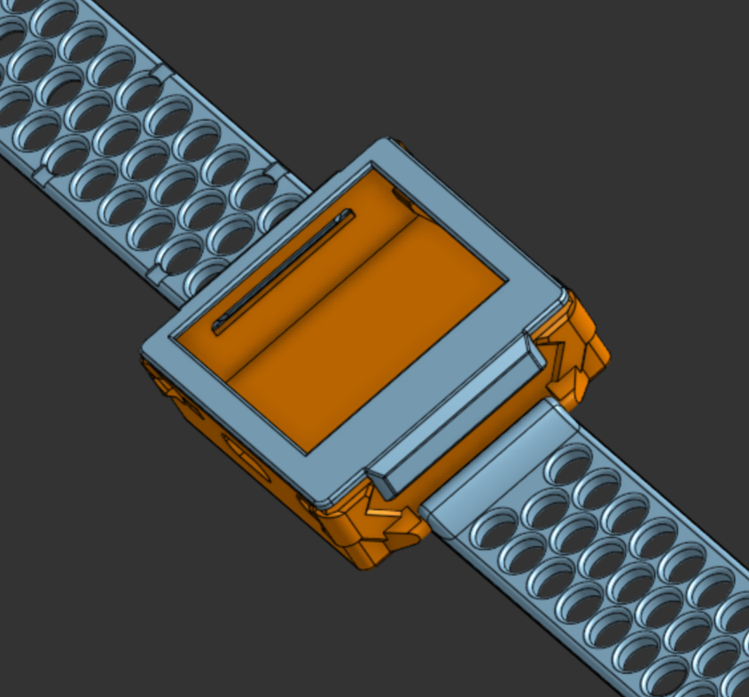

# Yatchy cases
If you create your own model, fork one, or anything else, please (in addition to putting it in your repository, on a 3D model website, if you feel like it, etc.) contribute it here so it won't get lost in the ether of poor search engines. Sharing files that can be modified easily (STEPs, not STLs) is also suggested, but not required.

## Szybet's side case

  
  
  

Fit and dissasembly demo

  

https://github.com/user-attachments/assets/d5af4c48-378c-4553-9d58-3c49acbb4d74

Notes:
- Yes, it's designed for the battery to be on the side (and more space for module hackery), yes you can modify it for your needs
- The top snaps into the bottom case, no screws, it's tight and easy to dismantle
- The strap & battery case is printed from a flexible material, TPU in this example.
- Requires a 0.2 nozzle, a **very good 3D printer**. The tolerances are very tight. - for the case, the layer adhesion must be good otherwise it could break when buttons are inserted. (Semi transparent PETG has good layer adhesion, I think)
- The motor cover is for this motor: https://pl.aliexpress.com/item/1005004948677826.html?gatewayAdapt=glo2pol
- The module led cover is for the led to redirect the light to the side. I used a silver marker for better effect
- The side battery case has many files in it, they all should be printed as they are
- Needs strong layer adhesion, otherwise it will break near the edges. Some glue on the inside or transparent PETG does the job

License:

[Creative Commons (4.0 International License) Attribution—Noncommercial—Share Alike](https://creativecommons.org/licenses/by-nc-sa/4.0/)

### Szybet's brick case

  
  
  
  

Notes:
- This is a fork of "Szybet's side case", most of the notes from there apply here (license too), the design of the buttons, top is the same
- Yes, it's a simple brick, based on the side case, it's a base for modifying it for other cases with the battery inside
- The texture on the corners is for making them stronger, less breakable
- The strap still has cutouts for attaching something to them
- If the battery is inserted in a wrong way and the cables will touch the buttons, they might get stuck
