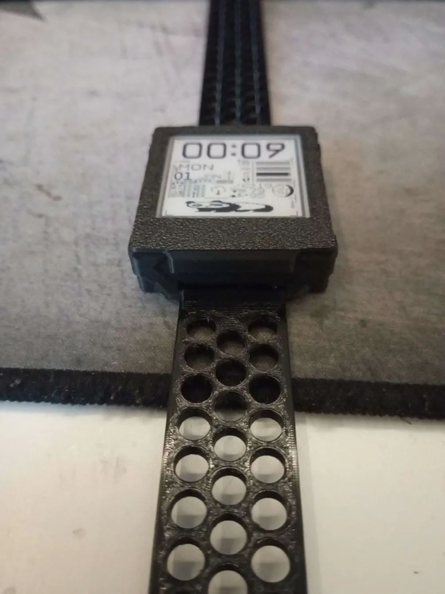
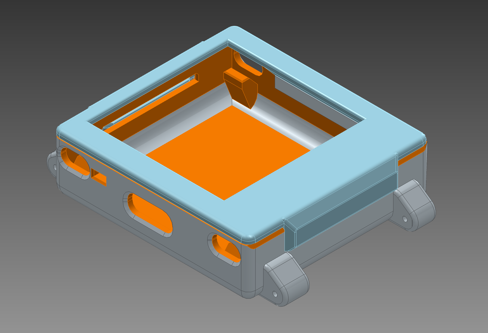

# Yatchy cases
If you create your own model, fork one, or anything else, please (in addition to putting it in your repository, on a 3D model website, if you feel like it, etc.) contribute it here so it won't get lost in the ether of poor search engines. Sharing files that can be modified easily (STEPs, not STLs) is also suggested, but not required.

### The files are in the folders in this directory

### JLC3D
If someone doesn't have a printer or wants some premium quality (materials), [Here is a review of JLC3D for yatchy cases](./JLC3D.md) (Not sponsored)

<h1>$${\color{red}Patches}$$</h1>
Because of the tight tolerances and different printers, filaments, some cases might have alternative parts that might fix your issues, read their description and decide for yourself, generally, I would advice using them

## Szybet's side case

  
  
  

Fit and dissasembly demo

  

https://github.com/user-attachments/assets/d5af4c48-378c-4553-9d58-3c49acbb4d74

Notes:
- Yes, it's designed for the battery to be on the side (and more space for module hackery), yes you can modify it for your needs
- The top snaps into the bottom case, no screws, it's tight and easy to dismantle
- The strap & battery case is printed from a flexible material, TPU in this example.
- Requires a 0.2 nozzle, a **very good 3D printer**. The tolerances are very tight. - for the case, the layer adhesion must be good otherwise it could break when buttons are inserted. (Semi transparent PETG has good layer adhesion, I think)
- The motor cover is for this motor: https://pl.aliexpress.com/item/1005004948677826.html?gatewayAdapt=glo2pol
- The module led cover is for the led to redirect the light to the side. I used a silver marker for better effect
- The side battery case has many files in it, they all should be printed as they are
- Needs strong layer adhesion, otherwise it will break near the edges. Some glue on the inside or transparent PETG does the job
- Patches nr 1 apply

License:

[Creative Commons (4.0 International License) Attribution—Noncommercial—Share Alike](https://creativecommons.org/licenses/by-nc-sa/4.0/)

### Szybet's brick case

  
  
  
  

Notes:
- This is a fork of "Szybet's side case", most of the notes from there apply here (license too), the design of the buttons, top is the same
- Yes, it's a simple brick, based on the side case, it's a base for modifying it for other cases with the battery inside
- The texture on the corners is for making them stronger, less breakable
- The strap still has cutouts for attaching something to them
- If the battery is inserted in a wrong way and the cables will touch the buttons, they might get stuck
- Patches nr 1 apply

### KitKat's rotated case

  
  
  
  

  
  
  
  

**The Images above are for the 150Mah case version**

  

**The Image above is for the 250 mah case version**

#### Proof of concept: Glow in the dark transparent filament (With the rotated case)

https://github.com/user-attachments/assets/10055fae-86bb-440f-bbc3-9d33e8c1605a

  
- Kind of a backlight, I can read the time. It could be improved in many ways (Increase led brightness, use a reflective tape inside the case)
- The glow in the dark filament looks better in reality than on camera

Notes (About this case in general):
- The 250 mah battery is 30 x 20 x 5 mm and the 150 mah battery is 25 x 20 x 4 mm
- The strap holders on the 250 mah version are assymetric
- This is a fork of "Szybet's side case", most of the notes from there apply here (license too), the design of the buttons, top is the same
- Requires changing the config in Inkwatchy so the screen is rotated properly
- The pieces that hold the straps need to be glued onto the main body using superglue
- The strap still has cutouts for attaching something to them
- The battery fits inside but requires short wires for it to fit properly 
- The motor is attached to the inside of the case which can make it more difficult to dissasemble
- Larger USB-C plugs may not fit due to strap clearance
- case_front_v2 and better_strap_dot from patches 1 applies
- Those are pictures of a prototype
- **The buttons are objectively easier to access**
- The LED now shines outside of your wrist, not on it                                                                                                                                         

### Glaucon1984's Brick case remix

  
  
  
  

Notes:
- The main purpose of this remix is to be able to use regular watch straps, make the case a bit stronger and have smoother edges, these are the main changes:
- Based on Szybet's brick case
- Made thicker walls and bottom
- Smooth edges
- Added prongs to attach a 22mm strap
  - It uses a standard 22mm watch strap, the one in the picture is this one: https://www.amazon.co.uk/dp/B0C2414BMX (nothing special about it, I think it was one of the cheapest ones)  
- Added some geometry to centre the circuit board
- The front panel hides a bit more of the bottom of the screen (you can see the picture)
- Buttons are slightly longer to account for the thicker walls in the case
- The holes for the buttons and the USB-C port are chamfered to hide the imperfection from 3D-printing supports
- The top case is slightly thicker
- The 3MF contains print settings, but just in case, it must be printed with a 0.2 mm nozzle. It's been tested only with PLA and it works great. I recommend a 0.6 mm layer heigh for precision. There's very little infill in the model but I would recommend to use gyroid at 30%. The watch case should be printed on the flat side of each part, the buttons should have this side touching the build plate:

- Creator's [makerworld page](https://makerworld.com/en/@glaucon1984) and [makerworld page for this case](https://makerworld.com/en/models/1798293-yatchy-brick-case-remix)

---

### 🧱 Thicc Case

It features thicker walls and a small light-reflecting patch — with translucent filament, you can use aluminum tape to redirect the light outward instead of it shining into your hand.  

The case includes an **easily removable and customizable faceplate**, supports **different straps across versions**, and requires **no glue**.  
It has been **roller-coaster tested** for fun, and with an acrylic faceplate, it even survived a **200 fps 1 g projectile** :D  

Designed for **easy customization**, it supports quick part and battery swaps without major modifications to the model itself.  
If any issues arise, feel free to reach out on Printables.  
Despite its rugged construction, it stays **ergonomic and comfortable** for everyday use.

The current design battery space is 33.9 x 25.9 x 5.4 (250mah was used and tested to work fine)

  
  
  
  
  
  
  

### ➡️ **View on Printables**

### 🎥 Watch the Demo

### Case comparison
- without top case or the pieces that hold the straps

| Case                            | Height (mm) |
|---------------------------------|-------------|
| Kitkat's Rotated 250 mAh version | 10.29477    |
| Kitkat's Rotated 150 mAh version | 8.70611     |
| Szybet's Side                   | 9.55611     |
| Szybet's and Glaucon1984's Brick                  | 10.96346    |
| glowbugs thicc case | 15.3         |
